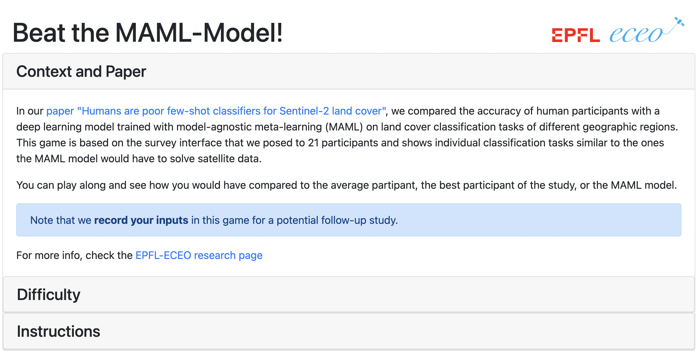
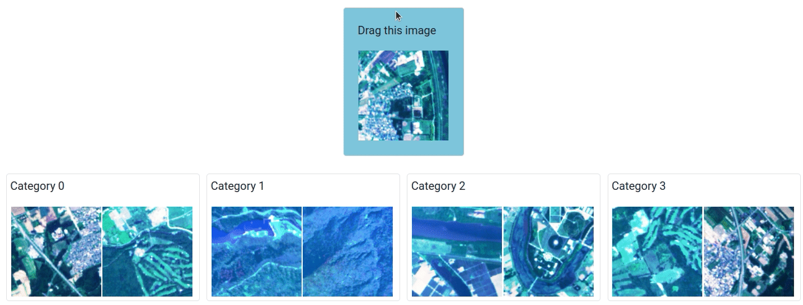

# Beat-the-MAML Game

This app showcases a gamified survey interface that we used in our paper ["Humans are poor few-shot classifiers for Sentinel-2 land cover"](IGARSS2022_HumanFewShotClassifiers.pdf), presented at the [IGARSS 2022](https://www.igarss2022.org/view_paper.php?PaperNum=2406) conference.

**Play with the app at [beat-the-maml.westeurope.cloudapp.azure.com](http://beat-the-maml.westeurope.cloudapp.azure.com/)**

---





please consider citing
```
@inproceedings{humanfewshot,
  title={Humans are poor few-shot classifiers for Sentinel-2 land cover},
  author={Ru{\ss}wurm, Marc and Wang, Sherrie and Tuia, Devis},
  booktitle={Proceedings of 2022 IEEE International Geoscience and Remote Sensing Symposium (IGARSS 2022)},
  year={2022}
}
```
alongside prior work on ["Meta-Learning for Few-Shot Land Cover Classification"](https://openaccess.thecvf.com/content_CVPRW_2020/html/w11/Russwurm_Meta-Learning_for_Few-Shot_Land_Cover_Classification_CVPRW_2020_paper.html)
```
@inproceedings{russwurm2020meta,
  title={Meta-learning for few-shot land cover classification},
  author={Ru{\ss}wurm, Marc and Wang, Sherrie and Korner, Marco and Lobell, David},
  booktitle={Proceedings of the ieee/cvf conference on computer vision and pattern recognition workshops},
  pages={200--201},
  year={2020}
}
```
if you derive scintific work from our studies.

## Run 

The run infrastructure is based on the [EPFL-ENAC helloFlask](https://github.com/EPFL-ENAC/helloFlask) template to run:

- locally with Flask command (dev)
- locally with Gunicorn (test)
- locally or on server with Gunicorn inside Docker (prod)

## locally

Run the following commands :

```bash
make setup # only once
make generate-selfsigned-cert # only once

make run-dev # dev mode (Flask)
make run-prod # test mode (Gunicorn)
make run # prod mode (Gunicorn inside Docker)
```

## on server

Run the following command :

```bash
make run # prod mode (Gunicorn inside Docker)
```

Stop the service :

```bash
docker-compose down
```

## Check result

- dev / test : browse to http://localhost:5000
- prod : browse to https://localhost (you'll have to accept self signed certificate)
